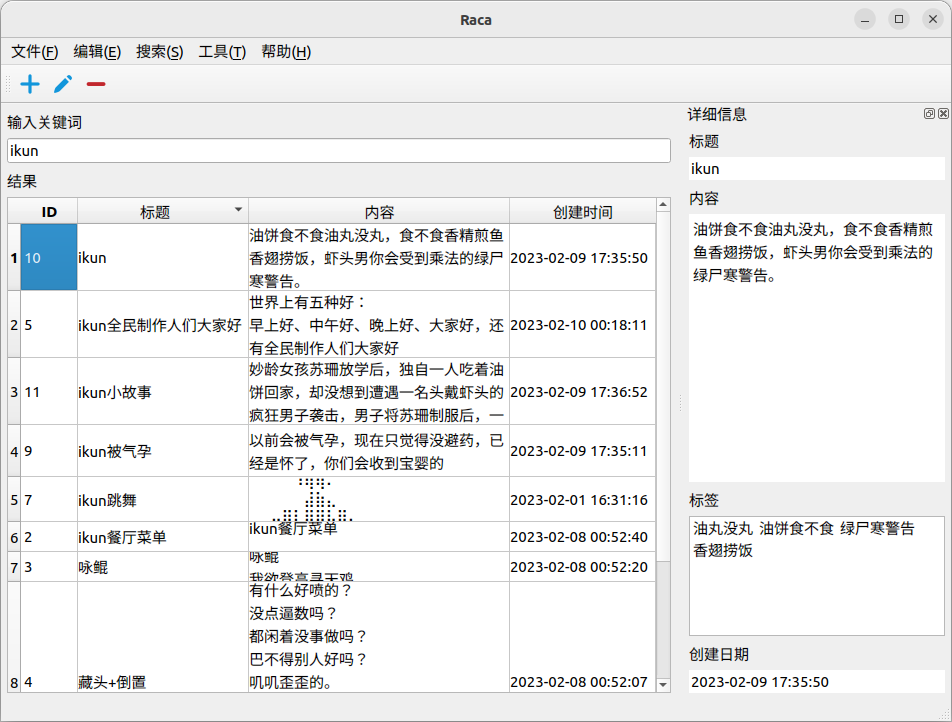
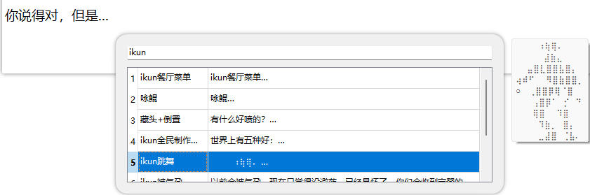

    

        
    

    <h1>😅 Raca (桌面端)</h1>
    

        
        
        
        
        
        
	

    

        <b>Raca (Record All Classic Articles)</b>，一个在本地<b>记录、查找抽象段落/评论区小作文</b>的工具。
    

    

        您还在为记不住小作文内容，面临<b>前面、中间、后面都忘了</b>的尴尬处境吗？使用这款工具将<b>帮助您记录您所遇到的小作文</b>，再也不因为忘记而烦恼！😋
    

    

        <a href="https://github.com/SkyD666/Raca-Android" style="text-decoration:none" >
            📱Android端请点击这里
        </a>
    

## 💡主要功能

1. 支持为段落打**标签**
2. 支持快捷键**快速搜索输入（仅Windows支持在输入光标处显示）**
3. 支持设置**搜索域**（设置搜索**数据库表的字段**）
4. 支持使用**正则表达式搜索**
5. 支持设置功能**全局热键（不支持Wayland）**
6. 支持**导出数据库**为CSV文件
7. 支持**最小化**到**托盘**
8. 支持**自动设置开机启动（仅支持Windows）**
9. ......

## 💻支持平台（Qt 6.4.2）

**测试平台：Windows 11 22H2, Ubuntu 22.10**

- **仅支持64位**操作系统
- Windows 10 21H2 (1809 or later)
- Windows 11 21H2 (1809 or later)
- Ubuntu 20.04 or later (目前需自行编译)
- Mac OS 和其他 Linux 系统未测试！

## 🤩应用截图

### 首页

截图来自 Ubuntu 22.10

### 快速输入

截图来自 Windows 11 22H2

## 🧑‍💻参与开发

**欢迎提PR！**

**个人的不足：**

- 本人是**业余的 C++ 开发者**，只会一点点 C++，代码中或许有很多错误/不优雅的写法
- 本人**无 Mac 电脑**，无法对 Mac 平台进行**适配**

## 🎉特别感谢

- [QHotkey](https://github.com/Skycoder42/QHotkey)注册**全局热键**(有修改)

## 📃许可证

使用此软件代码需**遵循以下许可证协议**

[**GNU General Public License v3.0**](LICENSE)
