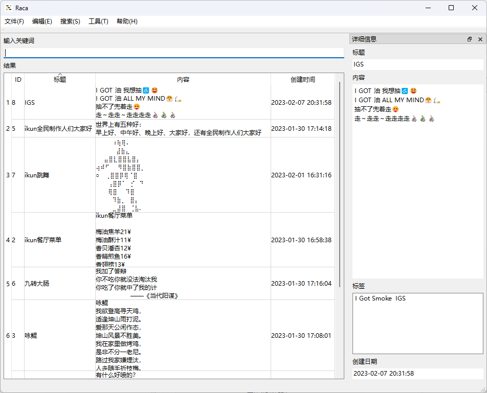

    

        
    

    <h1>😅 Raca</h1>
    

        
        
        
        
	

    

        <b>Raca (Record All Classic Articles)</b>，一个在本地<b>记录、查找抽象段落/评论区小作文</b>的工具。
    

    

        您还在为记不住小作文内容，面临<b>前面、中间、后面都忘了</b>的尴尬处境吗？使用这款工具将<b>帮助您记录您所遇到的小作文</b>，再也不因为忘记而烦恼！😋
    

## 💡主要功能

1. 支持为段落打**标签**
2. 支持快捷键**快速搜索输入**
3. 支持**导出数据库**为CSV文件
10. 支持**最小化**到**托盘**
11. 支持**跟随系统启动**
12. ......

## 💻支持平台（Qt 6.4.2）

- **仅支持64位**操作系统
- Windows 10 21H2 (1809 or later)
- Windows 11 21H2 (1809 or later)
- 计划中：Ubuntu 20.04 or later

## 🤩应用截图

#### 首页

## 🎉特别感谢

- [QHotkey](https://github.com/Skycoder42/QHotkey)注册**全局热键**(有修改)

## 📃许可证

使用此软件代码需**遵循以下许可证协议**

[**GNU General Public License v3.0**](LICENSE)
